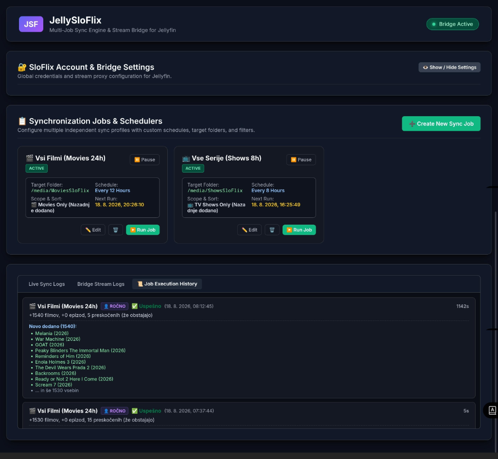
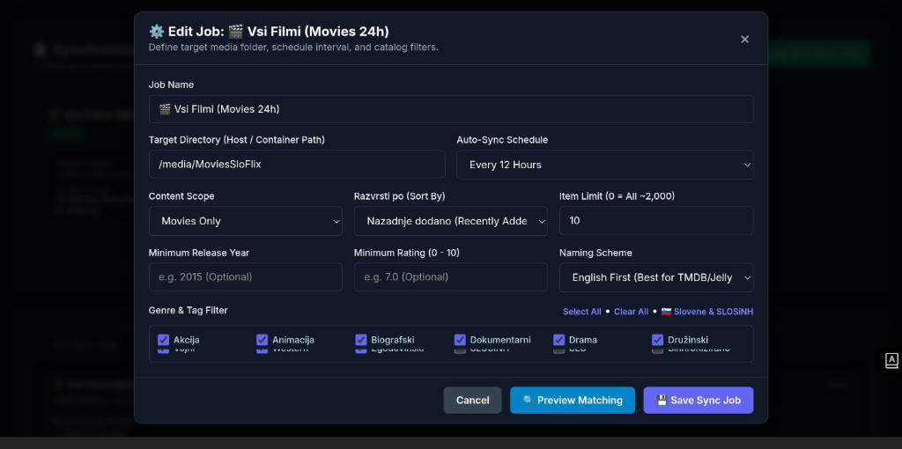
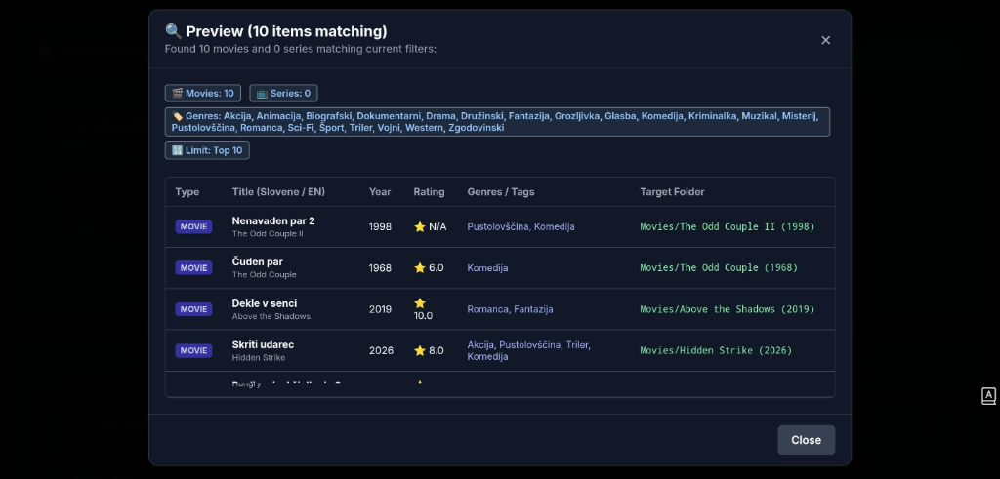

# JellyVoyo 🎬🇸🇮

> **JellyVoyo** is a lightweight, self-hosted web manager, multi-job sync engine, and streaming bridge that seamlessly integrates **Voyo.si** media catalog into **Jellyfin** (or Emby/Plex).

It generates TMDB-compliant `.strm` stream files, downloads official **posters**, **fanarts / backdrops**, creates Kodi/Jellyfin-compatible **`.nfo` metadata**, and provides both **WebVTT (`.sl.vtt`)** and **SubRip (`.sl.srt`)** subtitles, while providing an authenticated streaming bridge with instant HTTP 302 redirects and native AES-128 HLS playback support.

---

## 📸 Screenshots

### 1. Dashboard & Multi-Job Schedulers with Execution History


### 2. Job Configuration & Custom Filtering


### 3. Sync Preview & Item Selection


---

## ✨ Features

- **🌐 Modern Dark-Themed Web Dashboard**: Clean interface to manage jobs, preview syncs, test auth, inspect live logs, and view execution history.
- **🔐 Multi-Profile Voyo Integration**: Connects to the Voyo.si GraphQL API (`https://gql.voyo.si/v2`), automatically fetching user profiles and letting you select your preferred profile with active subscription.
- **🍿 Jellyfin Auto-Library Refresh**: Automatically triggers Jellyfin API `/Library/Refresh` immediately when new movies or episodes are synced, ensuring newly added content appears in Jellyfin instantly.
- **📄 Native `.nfo` Metadata Generation**: Generates standard `movie.nfo` and `tvshow.nfo` with Slovene synopses, ratings, genres, and premiere dates so that Jellyfin displays localized metadata without relying on external scrapers.
- **💬 Dual Subtitles & VTT &rarr; SRT Conversion**:
  - Automatically extracts Voyo `.sl.vtt` subtitles from the HLS stream playlist and converts them into standard `.sl.srt` format beside each `.strm` file during sync.
  - Includes a one-click tool in the Web Manager to batch convert all existing `.vtt` subtitles across all movie and show folders.
- **📁 Graphical File Explorer**:
  - Built-in file browser to inspect media directories, view posters/fanart, review and edit `movie.nfo` / `.strm` files directly in the browser, and safely delete items or folders.
- **📋 Multi-Job Sync Scheduler**:
  - Create multiple independent sync profiles (e.g., *Movies every 24h*, *TV Shows every 8h*, *Kids / Cartoons to custom folder*).
  - Configurable intervals (`Every 1h`, `2h`, `4h`, `6h`, `8h`, `12h`, `24h`, or `Manual`).
- **🖼️ Posters & Fanart Artwork**: Automatically downloads official Voyo `poster.jpg` and `fanart.jpg` into each movie/show directory.
- **🔍 Advanced Catalog Filtering**:
  - Filter by **Release Year** (`Min Year`), **Rating** (`Min Rating`), and **Genre tags** (`Slovenski`, `Drama`, `Komedija`, `Kriminalka`, `Otroški`...).
- **📺 Full TV Series & Multi-Season Support**: Automatically parses all seasons (`Season 01`, `Season 02`...) and generates unique stream files for each episode (`S01E01`, `S01E02`...).
- **⚡ Native HTTP Streaming Bridge**: Acts as a streaming bridge for Jellyfin (`/play/:mediaId`), providing authenticated HLS streams with standard AES-128 encryption.
- **📜 Persistent Audit History**: Detailed job execution logs tracking newly added items vs. skipped items saved in persistent storage.
- **🐳 Docker Ready**: Single container setup with tiny memory footprint (~35 MB RAM).

---

## 📁 Directory & Media Structure

JellyVoyo produces the exact folder format required by Jellyfin:

```text
/DATA/Media/
├── MoviesVoyo/
│   └── Sutjeska (1973)/
│       ├── Sutjeska (1973).strm     <-- Stream link to Bridge
│       ├── Sutjeska (1973).sl.vtt   <-- Slovene WebVTT Subtitles
│       ├── Sutjeska (1973).sl.srt   <-- Auto-converted SRT Subtitles
│       ├── movie.nfo                 <-- Localized Kodi/Jellyfin Metadata
│       ├── poster.jpg                <-- High-res Poster
│       └── fanart.jpg                <-- Backdrop Fanart
│
└── ShowsVoyo/
    └── Ja, Chef! (2021)/
        ├── tvshow.nfo                <-- Series Metadata
        ├── poster.jpg
        ├── fanart.jpg
        ├── Season 01/
        │   ├── Ja, Chef! - S01E01.strm
        │   ├── Ja, Chef! - S01E01.sl.vtt
        │   ├── Ja, Chef! - S01E01.sl.srt
        │   └── ...
        └── Season 02/
            └── ...
```

---

## 🚀 Quick Start with Docker (Recommended)

### 1. `docker-compose.yml`

```yaml
version: '3.8'

services:
  jellyvoyo:
    container_name: jellyvoyo
    build: .
    restart: unless-stopped
    ports:
      - "3851:3851"
    environment:
      - NODE_ENV=production
      - PORT=3851
      - CONFIG_PATH=/config/config.json
      - MOVIES_DIR=/media/MoviesVoyo
      - SHOWS_DIR=/media/ShowsVoyo
      - BRIDGE_URL=http://jellyvoyo:3851
      - VOYO_USERNAME=your_email@example.com
      - VOYO_PASSWORD=your_voyo_password
    volumes:
      # Persistent configuration & history
      - /DATA/AppData/jellyvoyo/config:/config
      # Media output directory (same folder mounted in Jellyfin)
      - /DATA/Media:/media
    networks:
      - jellyfin-network

networks:
  jellyfin-network:
    external: true
```

### 2. Launch the Container

```bash
docker compose up -d --build
```

### 3. Open Web Manager

Open your browser at **`http://YOUR_SERVER_IP:3851`**.

---

## 🖥️ Local Installation (Without Docker)

### Requirements
- **Node.js** v18.0.0 or later.

### Installation

```bash
# Clone the repository
git clone https://github.com/dejkom/JellyVoyo.git
cd JellyVoyo

# Start the Web Manager & Bridge Server
npm start
```

Open **`http://localhost:3849`** in your browser.

---

## ⚙️ CLI Usage (Standalone Sync)

You can also run headless synchronization directly from the command line:

```bash
# Run dry-run sync with 5 items limit
node sync.js --dry-run --limit 5

# Full sync with credentials
node sync.js --username myuser@example.com --password mypass --output "C:/Jellyfin/media"
```
